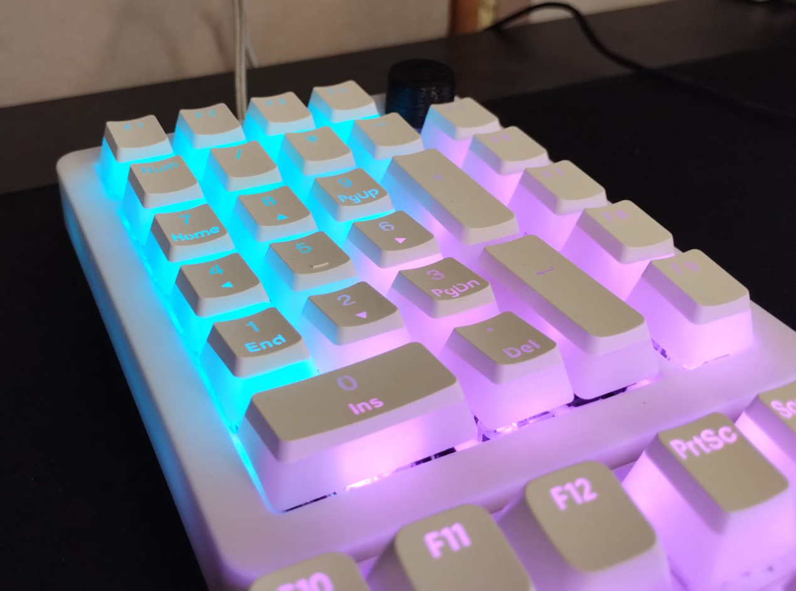
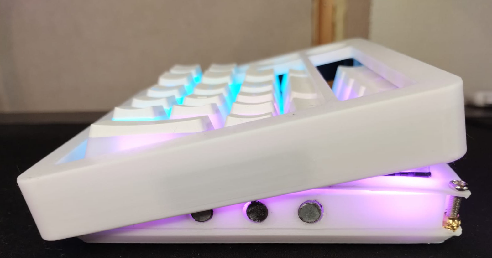
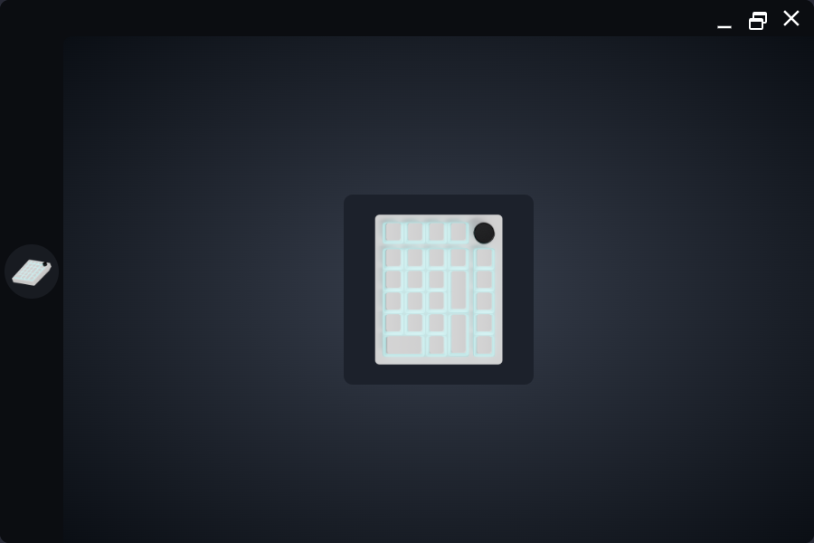
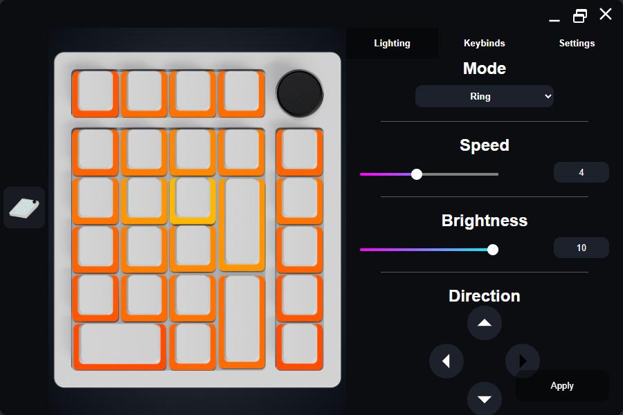

# About the project
This project is my answer to the lack of a satifying full-sized keyboard on the market (in a reasonable price). It is a numpad with 9 extra keys and a volume knob.
The numpad uses 6 magnets and magnetic tape embeded into the top case, which allow the user to switch the top case quickly, making customization easier. 

The firmware is written in C++ for raspberry pi pico (1), however it can surely be built for other microcontrollers.

The software part uses angular and electron (unfortunatelly your ram will likely suffer due to that, but the software doesn't need to be on all the time). The software allows the user to change the "global settings" of the lighting, and the "local settings" for each of the keys, not restricting to only the provided modes.   
No build setup is provided yet, but electron packager is included in the libraries already. You might have to tweak the build settings a bit.

Otherwise you can try the software by running the command
```bash
npm run electronTest
```

# Main Goal
The software is supposed to serve as a hub for custom RGB devices and includes a modular way of adding effects so adding any custom modes should be relatively easy.

# Project's Structure
The files are segregated depending on whether they are related to firmware, software, or physical build. The folder "Physical/Print Models" contains the STL files required to build the Numpad.

# Components
The following components were to assemble the numpad:
- Raspberry pi pico (1)
- Adafruit 4090 USB-C Breakout Board
- Addressable WS2812B LED strip
- EC12 20mm Rotary Encoder
- Magnetic Tape
- Magnets (6mm diameter | 3mm depth)
- 26 Switches (Any will work)
- Some jumper wires

# Assembly Instructions
Coming Soon

# Future of the project
The project is open for contributions and is supposed to be community-driven, therefore if there is any feature you would like to see-code it and share with the others.